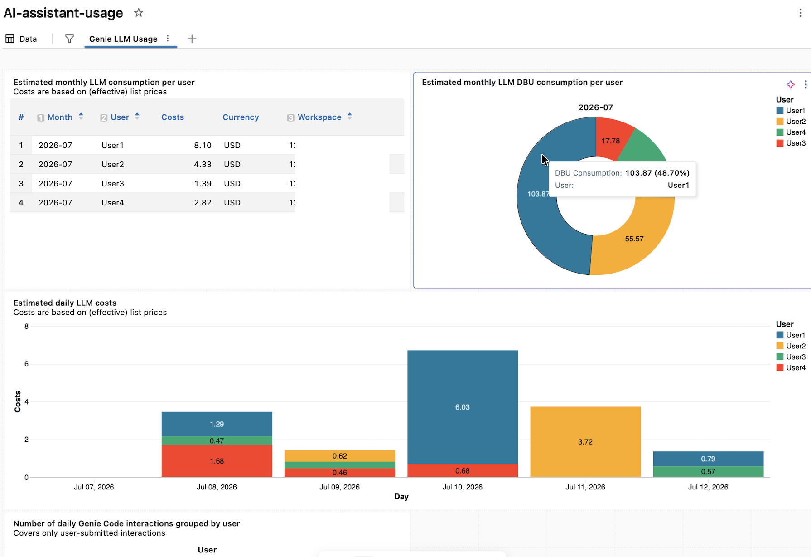

# Usage Dashboards

## Sample Screenshot

## Prerequisites
Dashboard queries run against Databricks warehouses so a warehouse needs to be available and selected. The dashboard created
by the **ai-assistant-usage.lvdash.json** file accesses three Databricks system tables and additional permissions may be required for the users, the official documentation 
describes the necessary steps [here](https://docs.databricks.com/aws/en/admin/system-tables/#grant-access-to-system-tables).
The system tables that get queried are: 
- system.billing.usage
- system.billing.list_prices
- system.access.assistant_events

## Installation
Download the JSON file **ai-assistant-usage.lvdash.json** that is included in this folder or paste its JSON content to 
a local file on your computer with a similar naming pattern. 

In a Databricks workspace, open the **Dashboards** tab on the left sidebar. Click on the "Create dashboard" button 
(right arrow) in the top right corner and then on "Import dashboard from file". An import window open up, choose the 
JSON file that was just created.
