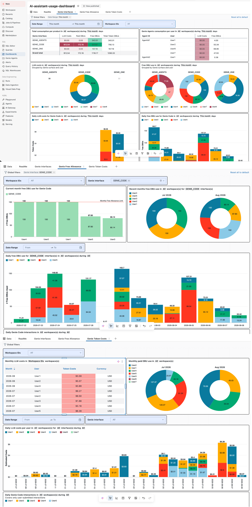

# Genie Usage Dashboards
The first version of the [ai-assistant-usage.lvdash.json](./ai-assistant-usage.lvdash.json) dashboard for Genie was 
published on the 8th of July 2026, some of its current widgets are depicted in the screenshots below.
Additional functionality will be added soon.

## Available Filters and Pages
Three filters are available across all pages:
- Workspace ID: Scope to one or more workspace(s)
- Date Range: Restrict the time window for daily and monthly charts
- Genie Interface: Filter by surface GENIE_CODE, GENIE_AGENTS, or GENIE_ONE

The dashboard consists of the following pages:
- **Genie Interfaces**: Detailed breakdown across Genie Code, Genie Agents, and Genie One including per-surface pivot totals, 
top users by token cost, agent-level consumption, and daily interaction counts.
- **Free Allowance**: Tracks daily and monthly consumption of the free LLM DBU allowance per user and Genie interface. Includes current-month
usage against the 150 DBU/user limit.
- **Token Costs**: Shows paid LLM token costs by user, workspace, and interface on daily and monthly granularity.

## Prerequisites
Dashboard queries run against Databricks warehouses so a warehouse needs to be available and selected. The dashboard created
by the **ai-assistant-usage.lvdash.json** file accesses three Databricks system tables and additional permissions may be required for the users, the official documentation 
describes the necessary steps [here](https://docs.databricks.com/aws/en/admin/system-tables/#grant-access-to-system-tables).
The system tables that get queried are: 
- system.billing.usage
- system.billing.list_prices
- system.access.assistant_events

## Installation
Download the JSON file [ai-assistant-usage.lvdash.json](./ai-assistant-usage.lvdash.json) that is included in this folder or paste its JSON content to 
a local file on your computer with a similar naming pattern. 

In a Databricks workspace, open the **Dashboards** tab on the left sidebar. Click on the "Create dashboard" button 
(right arrow) in the top right corner and then on "Import dashboard from file". An import window opens, choose the 
JSON file that was just created.

## Materialization strategies
Coming soon
