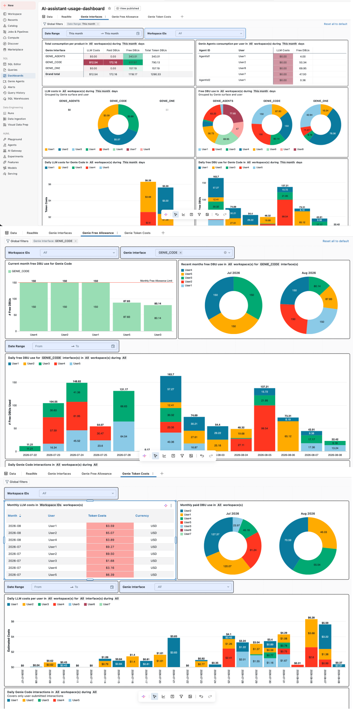
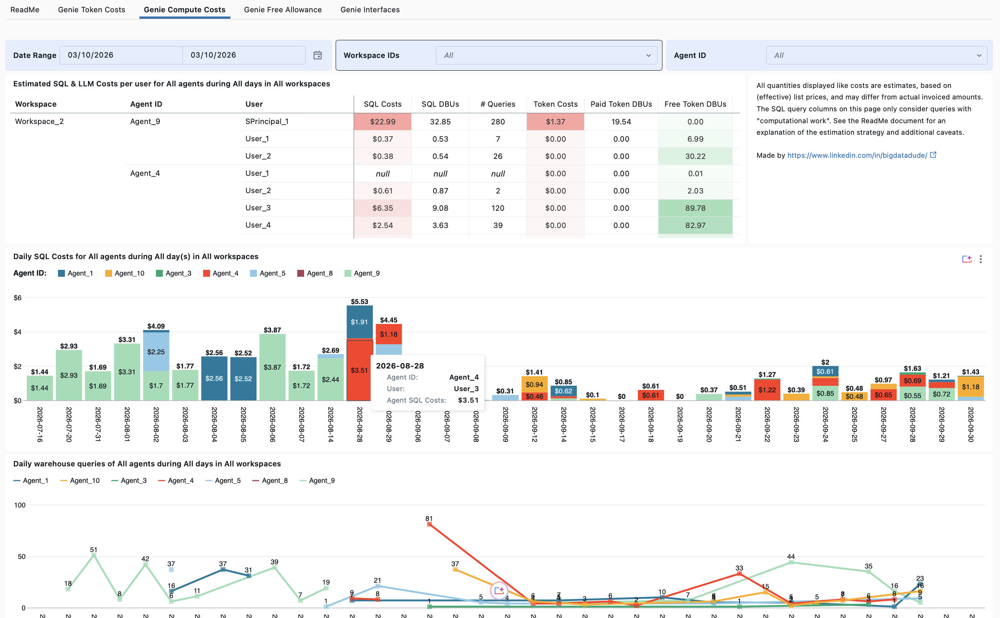

# Genie Usage Dashboards
The first version of the [ai-assistant-usage.lvdash.json](./ai-assistant-usage.lvdash.json) dashboard for Genie was 
published on the 8th of July 2026, some of its current widgets are depicted in the screenshots below.
Additional functionality will be added soon.

## Available Filters and Pages
The following filters are available:

| Filter | Scope | Description |
| :--- | :--- | :--- |
| **Workspace ID** | All pages | Scope to one or more workspaces |
| **Date Range** | All pages | Restrict the time window for daily and monthly charts |
| **Genie Interface** | All pages | Filter by `GENIE_CODE`, `GENIE_AGENTS`, or `GENIE_ONE` |
| **Agent IDs** | *Genie Compute Costs* only | Restrict to one or more Genie Agents available in the workspace |

 

The dashboard consists of the following pages:

**Genie Token Costs**: Paid LLM token cost tracking. Focuses exclusively on paid Genie usage (excludes the free allowance SKU). Provides both: 	> Daily view: Granular cost trends over time, filterable by interface and workspace 	> Monthly rollup: Aggregated cost per month (intentionally ignores the date range filter for full-history visibility)

**Genie Compute Costs**: Covers estimated SQL query costs & counts and LLM token costs & DBU usage of Genie Agents per user and warehouse on hourly and daily granularities. Visualisations include: 	> Estimated warehouse costs per agent 	> Warehouse costs per agent per day 	> SQL costs per warehouse 	> SQL query volume per warehouse See the bottom of this page for an explanation for the estimation logic.

**Genie Free Allowance**: Free DBU allowance monitoring. Tracks daily and monthly consumption of the free LLM allowance per user and Genie interface. Includes current-month usage against the 150 DBU/user limit for Genie Code. Visualisations include: 	> Pie chart: Recent months' free DBU use by user 	> Histogram: Daily free DBU consumption over time by user 	> Bar chart: Current month's free DBU use for Genie Code 	> Histogram: Daily Genie Code interaction counts (from assistant events, not billing)

**Genie Interfaces**: Helps identify which interface is driving the most usage. Detailed breakdown across Genie Code, Genie Agents, and Genie One including per-surface pivot totals, top users by token cost, agent-level consumption, and daily interaction counts.

## Prerequisites
Dashboard queries run against Databricks warehouses so a warehouse needs to be available and selected. The dashboard created
by the **ai-assistant-usage.lvdash.json** file accesses three Databricks system tables and additional permissions may be required for the users, the official documentation 
describes the necessary steps [here](https://docs.databricks.com/aws/en/admin/system-tables/#grant-access-to-system-tables).
The system tables that get queried are: 
- system.billing.usage
- system.billing.list_prices
- system.query.history (only for the _Genie Compute Costs_ page)
- system.access.assistant_events

## Installation
The official documentation describes the import of dashboards into Databricks workspaces [here](https://docs.databricks.com/aws/en/dashboards/automate/import-export#import-a-dashboard-file).

Download the JSON file [ai-assistant-usage.lvdash.json](./ai-assistant-usage.lvdash.json) that is included in this folder or paste its JSON content to 
a local file on your computer with a similar naming pattern. 

In a Databricks workspace, open the **Dashboards** tab on the left sidebar. Click on the "Create dashboard" button 
(right arrow) in the top right corner and then on "Import dashboard from file". An import window opens, choose the 
JSON file that was just created.

## Compute Cost Estimations

The *Genie Compute Costs* page estimates the SQL costs of Genie Agents, other surfaces like Genie Code will be covered soon. Its central *GenieComputeCosts* dataset combines records from the system.billing.usage table with system.billing.list\_price and system.query.history. The latter is a regional table so agents in workspaces from other cloud regions are not visible.

In Databricks system tables, individual query records do not have a dedicated cost column and usage rows cannot be directly joined with query history records for estimation purposes as necessary metadata is missing and usage records have an "hourly granularity". Furthermore, warehouses are shared compute resources, so queries from multiple users may run on the same warehouse concurrently. There is no single best answer to how query costs should be calculated in such scenarios, the *GenieComputeCosts* dataset assigns estimates based on the "computational work" that was required to answer agentic queries.

The underlying query of the *Genie Compute Costs* dashboard page calculates two cost streams for an agent independently and merges them based on identical time buckets. **SQL costs&#32;** are attributed proportionally using a CPU-time ratio approach:

- From the query history table, each Genie agent's "computational work time" is calculated per <workspace, warehouse, hour, agent, user> slot and the "total cpu time" of each warehouse is determined per hourly bucket. This approach ignores queries without any cluster computations, for example failed ones or queries that received their results directly from a caching layer.
- An agent's cpu time-share is divided by a warehouse's total cpu time from the same <workspace, warehouse, hour> bucket which results in a "cpu time ratio"
- This ratio gets multiplied by a warehouse's total billing cost from the usage table during the associated hourly bucket: If an agent consumed 30% of a warehouse's CPU time in a given hour, it is attributed 30% of that hour's warehouse bill. But if the warehouse served a Genie Agent exclusively during this time slot, the proportion would be 1 so the agent is assigned the full warehouse costs for that hour.

An agent's **LLM token DBUs/costs** are estimated with a method similar to other dashboard pages but all records are bucketed per <workspace, agent, user, hour>. LLM cost is "DBU usage quantity × effective list price" for paid SKUs, or zero for GENIE\_FREE\_USAGE. When an agent used multiple warehouses within an hourly bucket, its LLM info will only get assigned to the first warehouse row so overcounting is avoided.

At the end, the SQL costs are merged with the LLM quantities via a full outer join on <workspace, agent, user, hour> so agents with only token costs (no SQL queries) or only SQL costs (no billing LLM line) still appear. For more info, see the actual query and comments in the *GenieComputeCosts* dataset.

## Materialization strategies
Coming soon
