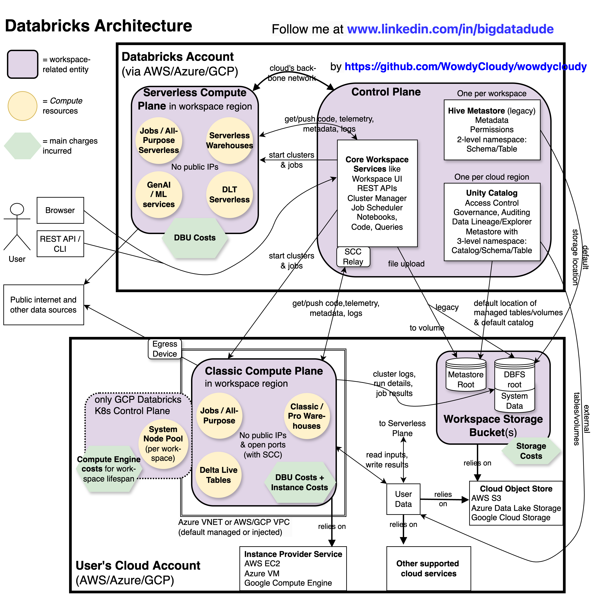

# Databricks Architecture

Databricks is a **Paas** (Platform-as-a-Service) cloud service offering that is integrated with all three major cloud providers. A **Databricks cloud account** can be opened on Amazon AWS, Microsoft Azure,
or Google Cloud Platform. One or more workspaces can then be deployed into AWS/Azure/GCP regions via a Databricks account. A **workspace** is the primary environment that engineering and analytical teams
use for working with Databricks objects and clusters, it connects their code/queries to compute resources and data assets. Multiple workspaces can be deployed into one or more cloud provider regions.
In a multi-cloud scenario, one Databricks account per provider is required for using workspaces on different platforms.

The following image provides a high-level Databricks architecture overview, the sections below describe its most important entities in more detail:

## Platform Planes
Databricks workspaces deployed to Amazon Web Services, Microsoft Azure, and Google Cloud Platform follow similar architectures consisting of two main components/layers:
- An internal **Control Plane** which is hosted in Databricks's cloud account. It stores workspace configurations and contains the core backend functionalities relating to the deployment (Web UI, Cluster administration, Job Scheduler, Rest APIs, ...)
- **Compute** (or Data) **Planes**: Where data is processed and Spark drivers/executors are launched

Compute _planes_ was used in the plural form because two subtypes can be distinguished based on the environment of their computational resources:
- **Serverless Compute Plane**: Resources reside in Databricks's cloud account in the same region as the associated workspace. Services like _Serverless SQL Warehouse_ entirely rely on this plane.
- **Classic** (or Traditional) **Compute Plane**: Data processing tasks run on VMs that are started in virtual networks under the user's own cloud account. For example, _Job Compute_ was one of the first offerings by Databricks and its Spark clusters
  consist of AWS EC2, Azure VM, or Google Compute Engine instances.

This compute layer difference has also major implications for the associated service costs which are described in the next [article](./costs.md).
Data teams do not directly interact with these compute planes, most of their work will involve the workspace UI which is a web application that, as depicted in the image, is hosted in the Databricks control plane.
Many account and workspace entities can also be contacted via REST [API](https://docs.databricks.com/api/workspace/introduction) or with the Databricks command-line interface.

## Databricks and Google Kubernetes Engine
In the overview [diagram](../resources/images/dbx-arch.png), Databricks on GCP occupies a dedicated area as it leverages Google's Kubernetes Engine which has architectural and cost implications: A new GCP Databricks workspace bootstraps a Kubernetes
cluster that will host the classic data plane, each workspace is associated with its own GKE cluster. A Spark cluster ist just a group of one or more nodes with a distinct K8s namespace in a workspace's GKE cluster.
Therefore, all Spark processes launched from the same workspace run in pods of the same K8s cluster. Each Spark driver and executor runs in a separate pod, a Virtual Machine instance hosts one Spark pod.  

Even if no workloads are executed, a system node pool is active at all times and incurs Compute Engine costs as multiple GCE instances run across multiple availability zones to support their workspace.
The official documentation [mentions](https://docs.gcp.databricks.com/en/getting-started/index.html#set-up-a-databricks-free-trial-and-first-workspace) per-workspace costs of "approximately $200/month, prorated to the days in the month that the GKE cluster runs", the next [article](./costs.md)
addresses such pricing aspects in more detail. As an automatic cost savings measure, any workspace GKE cluster gets deleted after five days of inactivity, i.e. when no Databricks clusters were launched during
that time period.

## Workspace Storage
Each Databricks workspace relies on at least one storage bucket/account in the object store of the user's cloud vendor. This resource hosts
- the DBFS root (explained below)
- the metastore root with the workspace's default catalog when Unity Catalog is enabled (see the Unity Catalog section)
- system data holding workspace and usage artefacts like logs, notebook revisions, or job results

**DBFS** (Databricks File System) is an HDFS-like abstraction over cloud-based object stores. The **DBFS root** is created during workspace deployment and mounted into a workspace and its clusters.
It is/was the underlying default storage container for some workspace operations and items like user files uploaded via the UI. The DBFS root also serves as the default location for the Hive metastore.
All users can access the root which was one of the reasons for the introduction of the Unity Catalog with its more fine-grained access policies. Several DBFS data access patterns
and directories (along with the Hive metastore) are now deprecated in favour of the functionality of the Unity Catalog.

## Unity Catalog

Coming soon

## Databricks Clusters
In the Big Data world, developers write distributed programs that are executed on a cluster of virtual or physical machines. Databricks supports multiple languages (Scala, SQL, Java, Python, R) in
several formats and offers different types of clusters referred to by the umbrella term **Compute**. On the Databricks platform, a **cluster** is a collection of one or more virtual machine instances. In
**Spark clusters**, one of these VM instances is special as the driver that executes the main program loop runs on it. The other instances are optional and host Spark executors that perform the actual
data processing work. One instance hosts one Spark executor.

The various cluster types can be configured and started in different ways such as via APIs, the Databricks CLI, SDKs, or directly from the workspace UI. A developer's
code artefact (like a notebook or JAR file) can often be executed on more than one Compute type, they are orthogonal. For example:
- Notebooks can be attached to All-Purpose and Job Compute. Pythonic and SQL notebook cells can run on Serverless Compute and SQL cells on SQL Warehouses.
- Job Compute tasks can be created from different assets such as notebooks, Python scripts/wheel packages, JAR files, SQL queries, DLT pipelines, or dbt projects.
- Several Job Compute task types (such as Python scripts or JARs) can be executed on an All-Purpose cluster. SQL tasks can only be run on SQL warehouses.

## Compute Types
The following table summarizes the major compute types on the Databricks platform. Some of them may not be available in all workspace regions or require activation/permission-granting by a user with
elevated privileges: 

<table><thead>
  <tr>
    <th colspan="2">Compute Type</th>
    <th>Summary</th>
  </tr></thead>
<tbody>
<tr>
    <td colspan="2">Classic <a href="https://docs.databricks.com/en/compute/use-compute.html" target="_blank" rel="noopener noreferrer">All-Purpose Compute</a></td>
    <td>Collaborative data science on a shared cluster, ad-hoc analytical queries</td>
  </tr>
  <tr>
    <td colspan="2">Classic <a href="https://docs.databricks.com/en/jobs/index.html" target="_blank" rel="noopener noreferrer">Jobs Compute</a></td>
    <td>Procedural definition & orchestration of ETL pipelines, data processing via Apache Spark tasks</td>
  </tr>
  <tr>
    <td colspan="2">Core/Pro/Advanced <a href="https://docs.databricks.com/en/delta-live-tables/index.html" target="_blank" rel="noopener noreferrer">Delta Live Tables</a></td>
    <td>Declarative definitions of ETL pipelines, streaming workloads</td>
  </tr>
  <tr>
    <td colspan="2">Classic/Pro <a href="https://docs.databricks.com/en/compute/sql-warehouse/index.html#use-sql-warehouses" target="_blank" rel="noopener noreferrer">SQL Warehouses</a></td>
    <td>SQL/BI queries against lakehouse tables on SQL-optimized clusters</td>
  </tr>
  <tr>
    <td colspan="2"><a href="https://docs.databricks.com/en/compute/pool-index.html" target="_blank" rel="noopener noreferrer">Instance Pools</a></td>
    <td>Idle instances for reducing startup/scaling times for classic compute clusters</td>
  </tr>
  <tr>
    <td rowspan="5">Serverless</td>
    <td><a href="https://docs.databricks.com/en/compute/serverless/notebooks.html" target="_blank" rel="noopener noreferrer">All-Purpose Compute</a>   (= Interactive Serverless) </td>
    <td>Supports SQL and Pythonic notebooks</td>
  </tr>
  <tr>
    <td><a href="https://docs.databricks.com/en/jobs/run-serverless-jobs.html#" target="_blank" rel="noopener noreferrer">Jobs Compute</a>   (= Automated Serverless) </td>
    <td>Supports Python notebook/script/wheel and dbt task types</td>
  </tr>
  <tr>
    <td><a href="https://docs.databricks.com/en/compute/sql-warehouse/index.html#what-are-serverless-sql-warehouses" target="_blank" rel="noopener noreferrer">SQL Warehouses</a></td>
    <td>Supports SQL editor/notebook queries</td>
  </tr>
  <tr>
    <td><a href="https://docs.databricks.com/en/delta-live-tables/serverless-dlt.html#configure-a-serverless-delta-live-tables-pipeline" target="_blank" rel="noopener noreferrer">DLT Pipelines</a></td>
    <td>Delta Live Tables pipeline updates</td>
  </tr>
  <tr>
    <td><a href="https://docs.databricks.com/en/machine-learning/index.html" target="_blank" rel="noopener noreferrer">Mosaic AI</a></td>
    <td>Machine Learning &amp; Gen AI tools</td>
  </tr>
</tbody></table>

Most of the compute types available to a user are listed under the _Compute_ tab in the workspace UI's sidebar.

## Serverless versus Traditional Compute
The previous table divides the Databricks Compute types into two main groups, namely **serverless** and **classic**/**traditional** services. This distinction affects various processing aspects
and configuration properties of a workload, some of the most important ones are summarized below:

<table><thead>
  <tr>
    <th></th>
    <th>Classic Compute</th>
    <th>Serverless Compute</th>
  </tr></thead>
<tbody>
  <tr>
    <td>Compute resources</td>
    <td>Launched into user's cloud account</td>
    <td rowspan="2">Compute resources reside in Databricks's cloud account and settings/tuning are managed by the serverless autoscaler, <a href="https://docs.databricks.com/en/release-notes/serverless/index.html#supported-spark-config" target="_blank" rel="noopener noreferrer">most</a> Spark configuration properties cannot be manually modified</td>
  </tr>
  <tr>
    <td>Configuration & Tuning</td>
    <td>Manually by user, self-managed with more control</td>
  </tr>
  <tr>
    <td>Costs</td>
    <td>Workload Cost = Cloud Provider Costs + DBU Costs   More details on this <a href="https://github.com/WowdyCloudy/wowdycloudy/blob/main/dbx/costs.md" target="_blank" rel="noopener noreferrer">page</a> </td>
    <td>Workload Cost = Only/mostly DBU Costs, cloud provider charges for secondary activities like data transfer might be incurred   Less transparency about DBU emission rates compared to Classic Compute </td>
  </tr>
  <tr>
    <td>Photon Engine</td>
    <td>Can be (de)activated, increases DBU consumption by a factor of 2.0 to 2.9 when enabled depending on cluster type & cloud provider</td>
    <td>Always enabled</td>
  </tr>
  <tr>
    <td>Idle Times</td>
    <td>Node bootstrapping and scaling phases, typically several minutes   <a href="https://docs.databricks.com/en/compute/pool-index.html" target="_blank" rel="noopener noreferrer">Instance Pools</a> reduce such idle times</td>
    <td>Shorter/no bootstrapping and scaling phases, instant compute</td>
  </tr>
  <tr>
    <td>Availability</td>
    <td>No restrictions</td>
    <td>Some services like Serverless SQL Warehouses might not be available in every region</td>
  </tr>
  <tr>
    <td>Runtimes</td>
    <td>Chosen by user; support for all languages</td>
    <td>Versionless, uses latest runtimes; Scala and R are not supported   More restrictions are mentioned <a href="https://docs.databricks.com/aws/en/compute/serverless/limitations" target="_blank" rel="noopener noreferrer">here</a></td>
  </tr>
</tbody>
</table>

## Jobs versus All-Purpose Compute

## SQL Warehouses

